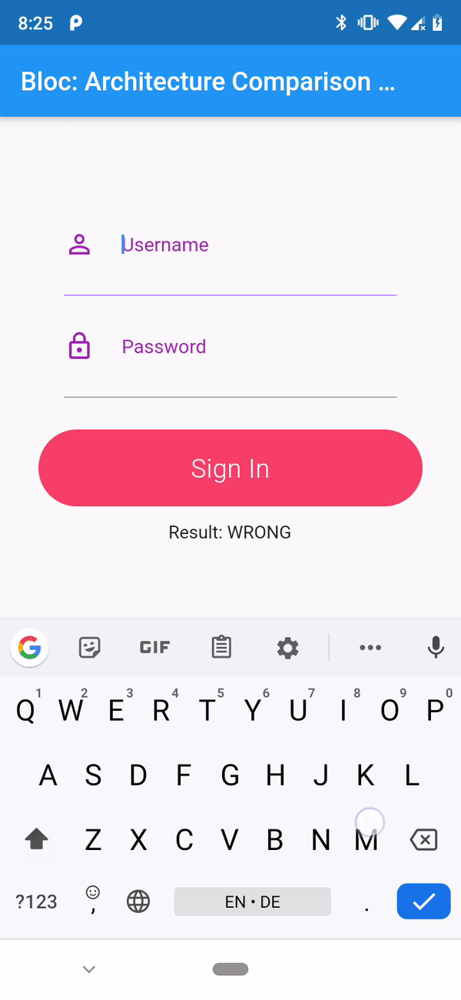

# BLoC vs package:provider vs redux

Compare leading Flutter architecture patterns with the help of:
## Flutter architectures comparison app

The idea behind this example application is to implement **simple user 
login** flow to demonstrate how specific Flutter architectures behave.  

#### Usage instrunctions

1. Import the project
2. Run it
3. Uncomment the following widgets to see architectures in action:
    - 'ProviderExamplePage' - package:provider example app
    - 'BlocExamplePage' - BLoC example app
    - 'ReduxExamplePage' - redux example app
    
#### User interface

