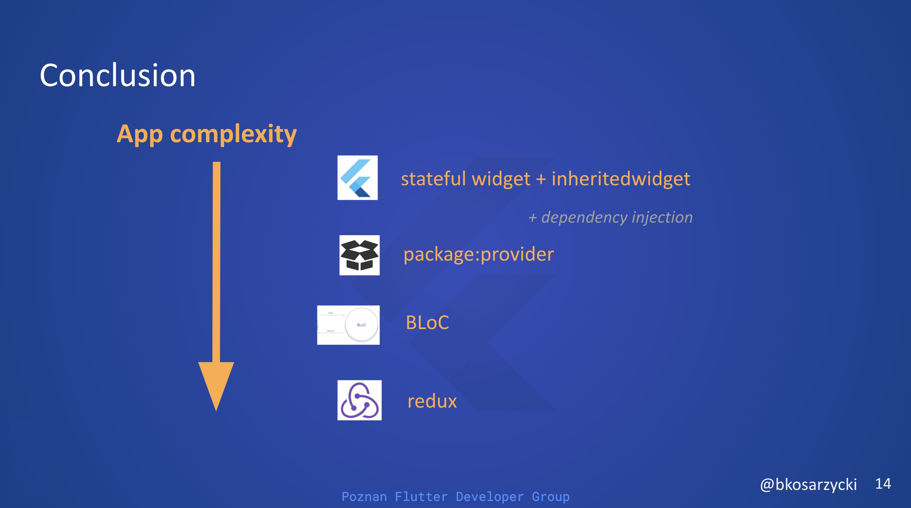

# BLoC vs package:provider vs redux

Compare leading Flutter architecture patterns with the help of:
## Flutter architectures comparison app

The idea behind this example application is to implement **simple user 
login** flow to demonstrate how specific Flutter architectures behave.  

#### Usage instrunctions

1. Import the project
2. Run it
3. Uncomment the following widgets to see architectures in action:
    - 'ProviderExamplePage' - package:provider example app
    - 'BlocExamplePage' - BLoC example app
    - 'ReduxExamplePage' - redux example app
    
#### User interface

### Conclusion

Growing complexity of the app calls for more sophisticated tools. 
In a small, 2 to 3 screen app inherited widget which is built into 
the Flutter framework might be enough. While the app grows you might
consider adding DI to your project and/or change the app architecture 
altogether. 

Package provider allows us to keep state across the app and provides a simple DI solution.

BLoC is more sophisticated and allows clear stream management.

Redux is most complex but on the other hand has a lot of benefits:
1. Clear data flow
2. Single store which can be serialized and stored
3. Easy logging of app events

